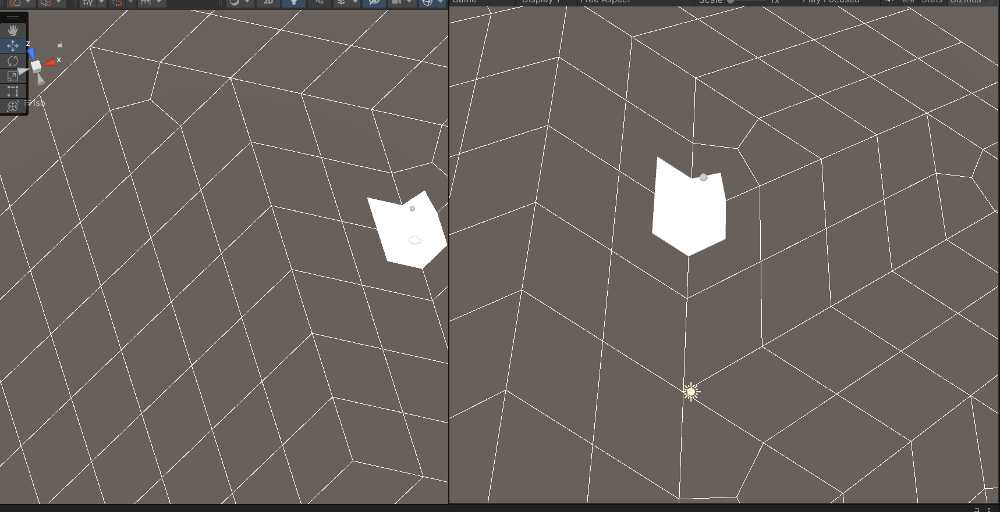
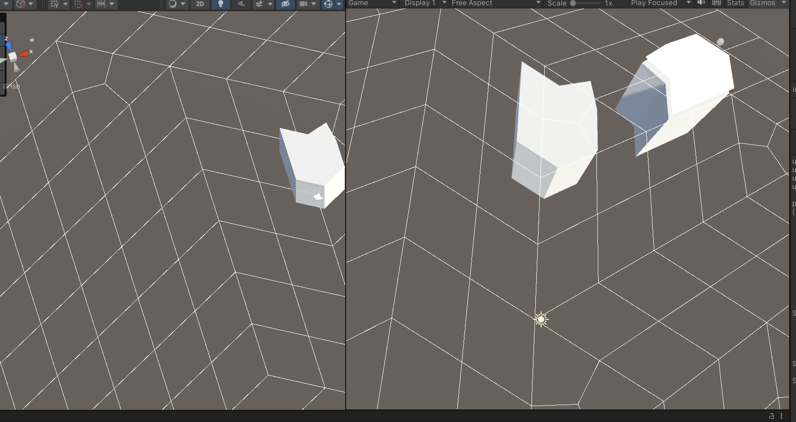
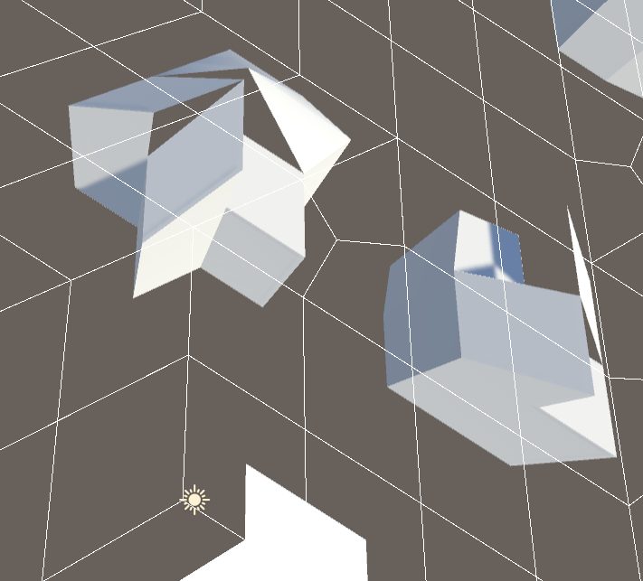
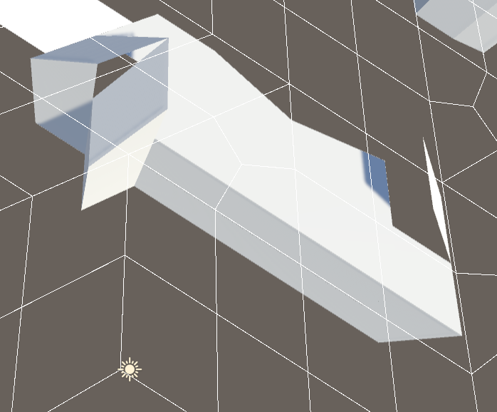
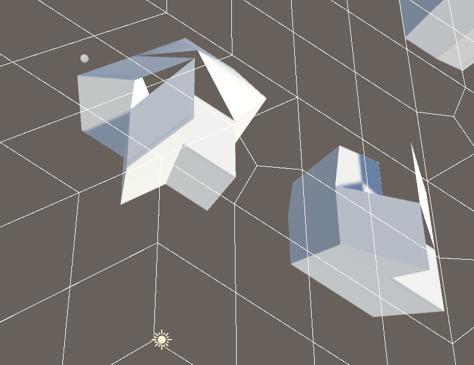

# TownScaper
TownScaper Demo
超级炫酷的仿TownScaper Demo

1. 六边形网格的生成、曲面细分与网格平滑处理(√)

   

2. Marching Cube算法的实现(√)

存在Bug：建筑有缝隙，应该是因为建模精度问题。

3. 建造系统

3.1 建造提示

3.2 点击建造

3.3 点击拆除

4. 波函数坍缩

状态1

坍缩

删除

## Reference

1. KaKabobi：[【城镇叠叠乐】【制作教程】用Unity实现Townscaper](https://www.bilibili.com/video/BV1wD4y1v7CE/?spm_id_from=333.788&vd_source=5d4070cc138983fa1babce80b5a31622)
2. [Hexagonal Grids](https://www.redblobgames.com/grids/hexagons/)
3. [《地图随机生成》波函数坍缩算法是如何实现的](https://www.bilibili.com/video/BV1Br421M7Vm/?spm_id_from=333.337.search-card.all.click&vd_source=5d4070cc138983fa1babce80b5a31622)
